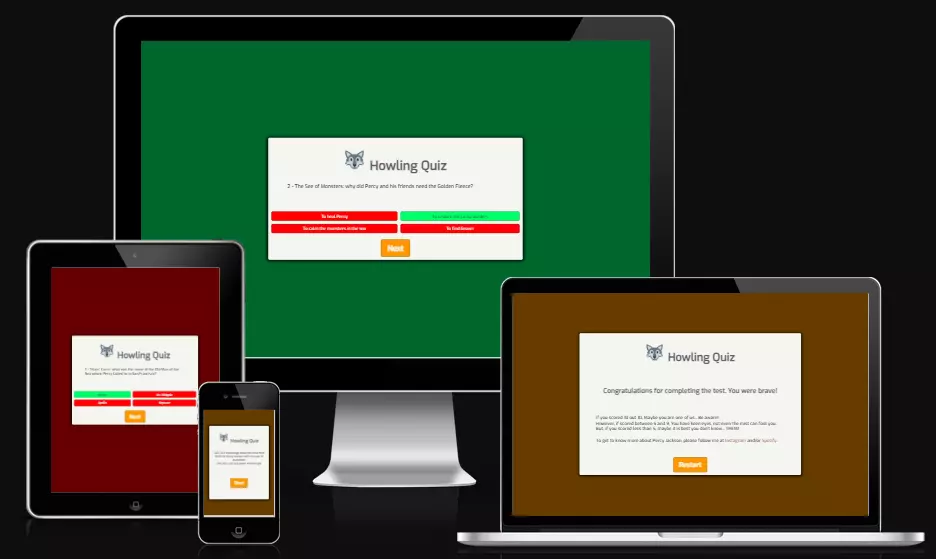

# HOWLING QUIZ

"Howling Books" is a podcast of a fictional (werewolf) character who tells stories to werewolves pups around a fire at night in a forest as it is the role of a Galliard of the werewolves. "Howling Quiz" is, then, a continuation of the "Howling Books" project, which aims to bring children's fantasy literature to people who have little time, ADHD, some visual impairment or who just prefer to listen to books. As the first project covered the Percy Jackson saga, the quiz today aims to build understanding and memory of books already recorded.

[Source](https://ui.dev/amiresponsive?url=https://tkml87.github.io/project-portfolio-2/)

Visit the deployed site: [Howling Quiz](https://tkml87.github.io/project-portfolio-2)

---

## CONTENTS

- [HOWLING QUIZ](#howling-quiz)
  - [CONTENTS](#contents)
  - [User Experience (UX)](#user-experience-ux)
    - [User Stories](#user-stories)
  - [Design](#design)
    - [Typography](#typography)
  - [Features](#features)
    - [The Home Page](#the-home-page)
    - [The Quiz Phase](#the-quiz-phase)
    - [The Result page](#the-result-page)
    - [The 404 error page](#the-404-error-page)
    - [General features on each page](#general-features-on-each-page)
    - [Accessibility](#accessibility)
  - [Technologies Used](#technologies-used)
    - [Languages Used](#languages-used)
    - [Frameworks, Libraries \& Programs Used](#frameworks-libraries--programs-used)
  - [Deployment \& Local Development](#deployment--local-development)
    - [Deployment](#deployment)
    - [Local Development](#local-development)
      - [How to Fork](#how-to-fork)
      - [How to Clone](#how-to-clone)
  - [Testing](#testing)
  - [Credits](#credits)
    - [Code Used](#code-used)
    - [Content](#content)
    - [Acknowledgments](#acknowledgments)

---

## User Experience (UX)

Howling Books is an audio-sharing project that makes books more accessible for people with reading difficulty, using mainly Spotify as a platform to publish the audio. As a non-profitable project, it does not make use of any ADs or any means of donation, so it does not ask for donations or monetary help from the audience in any way.

The owner does have a full-time job and other daily matters and is in a distant timezone, and occasionally may not post the weekly update to the podcast.

Key information for the site:

- What are the current book and the chapters uploaded.

- What will be the next book.

- How to help the podcast by participating in the reading voicing over a character.

- A way for people to contact the book club with questions and recommendations.

- Updates on what is coming to the podcast.

### User Stories

The Author asked me for a dramatic webpage, with illustrations of wolves and thing that bring audio rememberance. Dark colors, books and a page to talk about his reasons and lifestyle. He found the site good enough for his beginner's journey, but changes are in sight. Other users were not consulted before the launching.

## Design

### Typography

[Google Fonts](https://fonts.google.com/) was my choice for importing fonts to use in my project, as it doesn't require me to download the fonts to use them.

The font I chose this time is cleaner and more readable than the first project: Exo makes the text more reader-friendly.

[Font Exo](https://fonts.google.com/specimen/Exo)

## Features

The website comprises the "Home" page and the "Result" page. The "Home" page has a button link to the interactive quiz that leads the reader through 10 questions to the "Result" section.

### The Home Page

The home page of Howling Quiz displays the project's name as a title, a quiz call and then and the start button. Unfortunately, a score count wasn't made due to its bad responsiveness.

### The Quiz phase

The quiz the quiz consists of 10 questions about the first 3 books, with 4 alternatives each, only one of which is correct. To move from one question to another, you need to indicate an answer and click on the "next" button. When you reach the last question, the site automatically opens the "Result" page.

### The Result page

The Result page displays the site's name as a title. It also contains a text congratulates the reader on the quiz and has 3 answer choices, depending on how many questions the reader has marked in their notes. In the end, it also contains the author's network links to follow his audiobook work.

### The 404 error page

The 404 error page wasn't required for this project.

### General features on each page

All Pages on the website are responsive and have:

- A [favicon](https://favicon.io/emoji-favicons/wolf) in the browser tab.

- The title of the site at the top of every page. This title also acts as a link back to the home page.

### Accessibility

The author plans to voice reading what is writen for people who are not able to read easily without aid. A change of the colors may happen in the future also, to improve the user's experience.

## Technologies Used

### Languages Used

HTML, CSS and Javascript were used to create this websites.

### Frameworks, Libraries & Programs Used

- Git - For version control.

- [Github](https://github.com/) - To save and store the files for the website.

- [Google Fonts](https://fonts.google.com/specimen/Exo/about) - To import the font Exo used on the website.

- Google Dev Tools - To troubleshoot and test features, solve issues with responsiveness and styling.

- [Favicon.io](Favicon.io) To create favicon.

- [Conversor JPEG em WEBP](https://onlineconvertfree.com/pt/convert-format/jpeg-to-webp/).

- [Am I Responsive?](https://ui.dev/amiresponsive) To show the website image on a range of devices.

## Deployment & Local Development

The site is deployed using GitHub Pages - <https://tkml87.github.io/project-portfolio-2/>

### Deployment

Include instructions here on how to deploy your project. For your first project you will most likely be using GitHub Pages.

### Local Development

To Deploy the site using GitHub Pages:

1. Login (or signup) to Github.
2. Go to the repository for this project, <https://github.com/tkml87/project-portfolio-2> .
3. Click the settings button.
4. Select pages in the left hand navigation menu.
5. From the source dropdown select main branch and press save.
6. The site has now been deployed, please note that this process may take a few minutes before the site goes live.

#### How to Fork

To fork the repository:

1. Log in (or sign up) to Github.
2. Go to the repository for this project, <https://github.com/tkml87/project-portfolio-2>
3. Click the Fork button in the top right corner.

#### How to Clone

To clone the repository:

1. Log in (or sign up) to GitHub.
2. Go to the repository for this project, <https://github.com/tkml87/project-portfolio-2>
3. Click on the code button, select whether you would like to clone with HTTPS, SSH or GitHub CLI and copy the link shown.
4. Open the terminal in your code editor and change the current working directory to the location you want to use for the cloned directory.
5. Type 'git clone' into the terminal and then paste the link you copied in step 3. Press enter.

## Testing

## Credits

### Code Used

The Javascript codes was mostly based on the codes used in this Github project [WebDevSimplified](https://github.com/WebDevSimplified/JavaScript-Quiz-App/tree/master).

For linking Javascript buttons, I used this guide: [How to Create Button With Link in JavaScript | JavaScript Tutorial](https://www.youtube.com/watch?v=xVMkFJZhZYU).

The [Love Maths project](https://github.com/Code-Institute-Solutions/love-maths-2.0-sourcecode/tree/master) also helped me a lot to fulfill the end of this project.

I also had some help from [ChatGPT](https://chat.openai.com/).

### Content

All the content for the quiz, such as Q&A and congratulations' message were written by myself and my husband Luís Eduardo H. de F. Pereira (Client/Owner).

This Readme was generated based on the Code Institute instructions [here](https://github.com/Code-Institute-Solutions/SampleREADME). For its sintaxe, the guidance from Github [here](https://docs.github.com/pt/get-started/writing-on-github/getting-started-with-writing-and-formatting-on-github/basic-writing-and-formatting-syntax#syntax). I also followed the instructions [here](https://github.com/kera-cudmore/readme-examples/blob/main/README.md). [Kera Cudmore](https://github.com/kera-cudmore) was a life-saver.

I also used [Grammarly](https://app.grammarly.com/) and [Deepl](https://www.deepl.com/translator) to proofread my content.
  
### Acknowledgments

I would like to acknowledge the following people:

[Martina Terlević](https://www.linkedin.com/in/martinaterlevic/) - My Code Institute Mentor. Hvala!

[Luís Eduardo H. de F. Pereira](https://www.linkedin.com/in/luis-pereira-9b425452/) - My beloved husband and best friend.